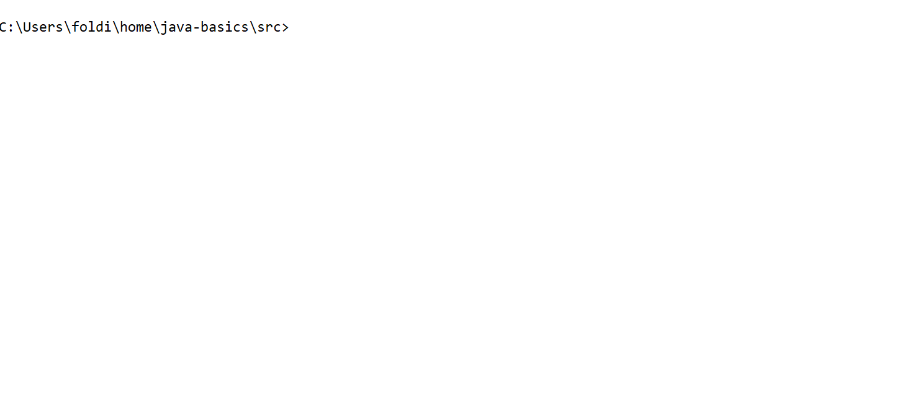

# Java Alapok

## Válozók létrehozása, primitív típusok

A java egy típusos nyelv, azaz minden változónak meg kell adni, hogy milyen típusú. Gondoljuk bele, hogy egy számot például nem lenne értelme elosztani "Nietzsche"-vel. Az alábbi példában láthatjuk a java által kínált néhány primitív típust, mint __boolean__, __byte__, __short__,  __int__, __long__, __float__, __double__, __char__, __String__.

```java
public class PrimitiveTypes {

    public static void main(String[] args) {
        boolean aBoolean = true;
        System.out.println(aBoolean);

        byte aByte = 127;
        System.out.println(aByte);

        short aShort = 2000;
        System.out.println(aShort);

        int anInt = 301210;
        System.out.println(anInt);

        long aLong = 23012020120132423L;
        System.out.println(aLong);

        float aFloat = 3212.202F;
        System.out.println(aFloat);

        double aDouble = 78687887.23123123;
        System.out.println(aDouble);

        char aChar = 'a';
        System.out.println(aChar);

        /*
            I'm a bit of a liar because String is not a primitive type
            but for simplicity we will consider it as it is.
        */
        String text = "Something long text about the meaning of life";
        System.out.println(text);
    }
}
```
Eredmény:



## Operátorok

A kövekező példában láthatsz néhány fontos operátort a java nyelvből.

```java
public class Operators {

    public static void main(String[] args) {
        int a = 2000;
        int b = 31;

        int c = a + b;
        System.out.println(c);

        int d = a - b;
        System.out.println(d);

        int e = a * b;
        System.out.println(e);

        double f = 9.32;
        double g = 1.93;

        double h = f / g;
        System.out.println(h);

        boolean aIsEqualB = a == b;
        System.out.println(aIsEqualB);

        boolean aIsNotEqualB = a != b;
        System.out.println(aIsNotEqualB);

        boolean resultOfAnAndOpertaor = (a > 200) && (b < -200);
        System.out.println(resultOfAnAndOpertaor);

        boolean resultOfAnOrOpertaor = (a > 2000000) || (b > -200);
        System.out.println(resultOfAnOrOpertaor);

        System.out.println(7 % 2); // We call it modulo, this is the remaining part after division

        int a2 = 5;
        a2++;
        System.out.println("a2 after ++ is " + a2);

        int a3 = 7;
        a3--;
        System.out.println("a3 after -- is " + a3);

        int a4 = 10;
        a4 += 7;
        System.out.println("a4 after += 7 is " + a4);

        int a5 = 1;
        a5 -= 7;
        System.out.println("a5 after -= 7 is " + a5);

        int a6 = 3;
        a6 *= 6;
        System.out.println("a6 after *= 6 is " + a6);
    }
}

```

Eredmény:


## Feltételek

Sokszor előfordul, hogy valamilyen feltételtől függöen mást és mást szeretnénk hogy a programunk csináljon. Ebben a részben láthatsz néhány példát az __if__/__else if__/__else__ nyelvi elemek használatára, amivel ezt elérhetjük.

```java
public class ConditionsExample {

    public static void main(String[] args) {
        boolean flag = true;
        if (flag) {
            System.out.println("This is a stupid example since this will be always true");
        }

        double flagNumber = Math.random();
        if (flagNumber < 0.59) {
            System.out.println("flagNumber < 0.59 is TRUE");
        } else {
            System.out.println("flagNumber < 0.59 is FALSE");
        }

        double flagOne = Math.random();
        double flagTwo = Math.random();
        if (flagOne + flagTwo > 1) {
            System.out.println("flagOne + flagTwo > 1 is TRUE");
        } else if (flagOne + flagTwo > 0.5) {
            System.out.println("flagOne + flagTwo > 0.5 is TRUE");
        } else if (flagOne + flagTwo <= 0.5 && flagOne + flagTwo >= 0) {
            System.out.println("flagOne + flagTwo <= 0.5 is TRUE");
        } else {
            System.out.println("I don't know what the hack are you doing but this is impossible");
        }

        String elvisOperatorExample = (Math.random() > 3.0 / Math.PI) ? "Value when the condition is true" : "... when ... is false";
        System.out.println(elvisOperatorExample);
    }
}
```


## Ciklusok

Sokszor előfordul, hogy valamit többször is meg kell csinálnunk. A lényeg itt hogy többször ugyanazt, vagy egy nagyon hasonló dolgot kell elvégeznünk. A programozásban ezt ciklusokkal érhetjük el vagy rekurzívan (erről majd később).

```java
public class LoopExample {

    public static void main(String[] args) {
        int maxNumber = 20;
        for (int i = 0; i < maxNumber; i++) {
            System.out.println(i);
        }

        for (int i = 0; i < maxNumber; i++) {
            int square = i * i;
            System.out.println(i + " square is " + square);
        }

        int number = 0;
        while (number < maxNumber) {
            int cube = number * number * number;
            System.out.println(number + " cube is " + cube);
            number++; // This means to increase the value of number by one
        }

        int count = 2000;
        do {
            System.out.println(
                    "The condition below is not true but because do while" +
                    " investigates it second this command will be executed at first.");
        } while (count < maxNumber);

        /*
         This will be a real beauty :)
        */
        for (int i = 0; i < 13; i++) {
            for (int j = 0; j < 13; j++) {
                System.out.print("|" + (Math.random() < 0.5692 ? " " : "O"));
            }
            System.out.print("|");
            System.out.println();
        }

    }
}
```

